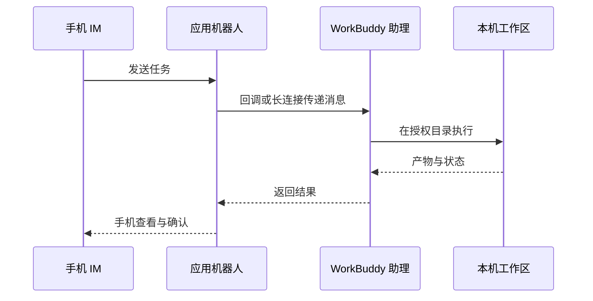

<!-- 由 scripts/sync.mjs 自动生成，请勿手改；改上游或改脚本。 -->

> 上游: [`docs/bluebook/第一篇 使用手册：先把 WorkBuddy 用起来/第 8 章 WorkBuddy 接入小程序与 IM 助理/index.md`](https://github.com/AlephAITech/WorkBuddyGuide/blob/main/docs/bluebook/%E7%AC%AC%E4%B8%80%E7%AF%87%20%E4%BD%BF%E7%94%A8%E6%89%8B%E5%86%8C%EF%BC%9A%E5%85%88%E6%8A%8A%20WorkBuddy%20%E7%94%A8%E8%B5%B7%E6%9D%A5/%E7%AC%AC%208%20%E7%AB%A0%20WorkBuddy%20%E6%8E%A5%E5%85%A5%E5%B0%8F%E7%A8%8B%E5%BA%8F%E4%B8%8E%20IM%20%E5%8A%A9%E7%90%86/index.md) · 站点: [https://workbuddy.homes](https://workbuddy.homes/) · 同步自 commit `e510a2c8`

# 第 9 章 WorkBuddy 接入小程序与 IM 助理

## 小程序的两种模式

| 模式 | 任务在哪里运行 | 是否依赖电脑在线 | 适合任务 |
|-|-|-|-|
| 本机模式 | 已连接的电脑 | 是 | 本地文件、本地 Skill、已有工作区 |
| 云端模式 | 隔离的云端环境 | 否 | 调研、写作、临时分析、并行任务 |

**首次使用**

1. 通过官方入口打开 WorkBuddy 小程序并登录；
2. 查看当前处于本机还是云端模式；
3. 本机模式下确认目标电脑在线且连接正确；

## IM 助理的工作链路

## 接入微信助理：扫码绑定即可

1. 打开 WorkBuddy，在左侧“助理”栏点击齿轮，进入“助理设置”；

2. 找到“微信助理集成”，点击“配置”；

3. 等待绑定二维码生成，用手机微信扫码；

4. 卡片显示“已绑定”后，先发送一条只读测试指令；

5. 需要切换微信账号时，先解绑当前账号，再重新扫码。

二维码有时效限制。停留在“绑定中”、二维码过期或扫码失败时，关闭配置窗口后重新进入，必要时重启 WorkBuddy 并重新生成二维码。

***来源：WorkBuddy 官方指南。***

## 接入飞书

本节介绍在飞书聊天窗口中向 WorkBuddy 助理发送任务的方法。在 WorkBuddy 中读取飞书群聊、文档和日程的连接器用法，见[第 8 章 飞书办公实战：从接入到交付](part1-ch08-2.md)。

1. WorkBuddy → 设置 → 助理设置 → 选择飞书；

2. 在飞书开放平台创建企业自建应用；

3. 为应用添加机器人能力；

4. 按 WorkBuddy 当前页面要求开通最小权限；

5. 在“凭证与基础信息”获取 App ID 和 App Secret；

6. 将凭证填写到 WorkBuddy，生成或复制回调信息；

7. 在飞书配置事件订阅与回调；

8. 添加接收消息、卡片交互等当前指南要求的事件；

9. 创建版本并发布应用；

10. 在飞书内向机器人发送只读测试任务。

***来源：WorkBuddy 官方指南。***

## 接入钉钉

1. 创建应用与机器人使用企业管理员账号登录钉钉开发者后台；

2. 进入“应用开发”，创建应用；

3. 为应用添加机器人能力，填写机器人名称、描述和头像并确认发布；

4. 优先在测试组织或测试群完成验证。

***来源：WorkBuddy 官方指南。***
